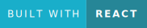
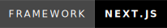

<h1 align="center">
    
</h1>

<h3 align="center">Next.js Typescript frontend for <span style="font-weight:bold;">straysafe</span> — a stray animal reporting platform</h3>
<h4 align="center">(soon to be open-source!)</h4>

<div align="center">
  <a href="https://forthebadge.com">
    
  </a>
  <a href="https://forthebadge.com">
    
  </a>
  <a href="https://forthebadge.com">
    
  </a>
  <a href="https://forthebadge.com">
    
  </a>
</div>
<br/>

<p align="center">
  <a href="#features">features</a> •
  <a href="#getting-started">getting started</a> •
  <a href="#running">running</a> •
  <a href="#tech-stack">tech stack</a> •
  <a href="#project-structure">project structure</a> •
  <a href="#license">license</a>
</p>

---

## features

- React-based frontend with Next.js and TypeScript
- integrated with straysafeAPI for stray animal sightings
- supports basic user authentication
- dynamic map UI to see sightings in the area
- Swagger documentation integration

## getting started

**prerequisites:**

- [Node.js (v16 or later)](https://nodejs.org/en/download/)
- [Vercel account](https://vercel.com) (if you aim to work with production! be sure to log in with GitHub)
- `.env.local` file (contact me for details)

**clone and run:**

```bash
# Clone the repo
git clone https://github.com/hassankgit/stray-safe-v1-frontend.git
cd stray-safe-v1-frontend

# Set up environment variables
# please contact me for the .env.local file :D

# Install dependencies
npm install

# Run the development server
npm run dev
```

## running

### for local development:

- to start the development server, run the following command:

```bash
npm run dev
```

- the frontend should be running at <span style="font-weight:bold;">http://localhost:3000</span>

### for production:

- build the project and run the production instance:

```bash
npm run build
npm run start
```

- locally this will also be available at http://localhost:3000.

## tech stack

- React.js
- Next.js
- TypeScript
- Vercel for deployment

## project structure

```
stray-safe-v1-frontend/
|
├── .next/                     # Next.js build output
├── node_modules/              # project dependencies
├── public/                    # static assets (images, fonts, etc.)
├── src/                       # main source code
│   ├── app/                   # Next.js app components (routes, layouts, pages, etc.)
│   ├── components/            # global components
│   ├── styles/                # global styles (CSS, SCSS)
│   ├── swagger/               # Swagger integration/endpoints
│   ├── .env.local             # environment variables (for local dev)
│   ├── next.config.ts         # Next.js config
│   ├── package.json           # project dependencies & scripts
│   ├── README.md              # you are here!
│   └── tsconfig.json          # TypeScript configuration
|
├── .gitignore                 # git ignore file
├── eslint.config.mjs          # eslint configuration
└── package-lock.json          # npm lock file
```

## license

open source license coming soon!
